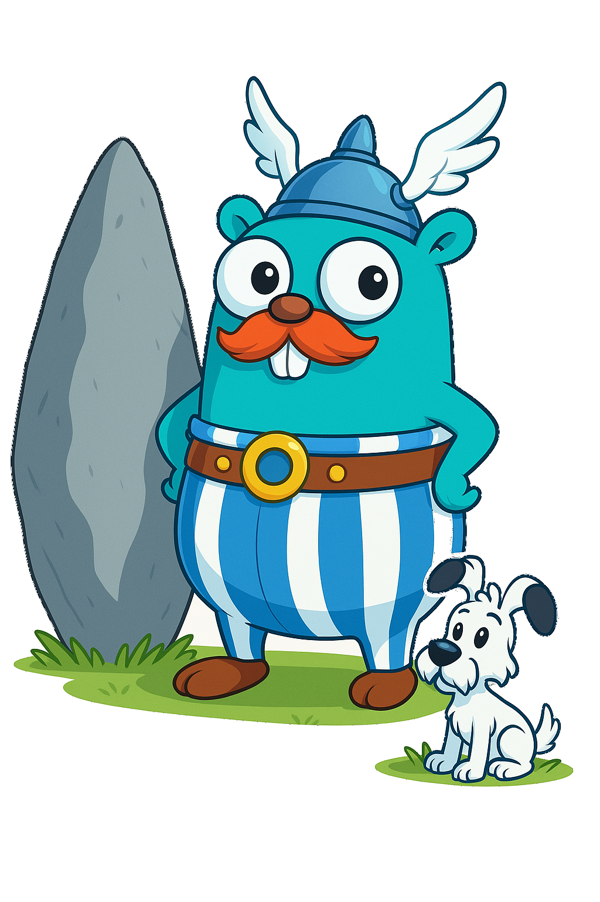

<p align="center">
  
</p>

<p align="center">
    <h1> Gobelix - The Golang ASTERIX Package</h1>
</p>

Gobelix is a high-performance Go library for encoding and decoding ASTERIX (All-purpose STructured Eurocontrol SurveIllance Information EXchange) protocol messages. ASTERIX is a binary protocol standardized by EUROCONTROL for exchanging surveillance data in Air Traffic Management systems.
<div align="center">
  
  
  
</div>

## Disclaimer

This project is a work in progress. The author assumes no responsibility or liability for any errors, omissions, or damages arising from the use of this software. Use at your own risk.

## Installation

```bash
go get -u github.com/davidkohl/gobelix
```

## Supported Categories

| Category | Description | Versions |
|----------|-------------|----------|
| CAT001 | Monoradar Target Reports (Plot/Track) | 1.2 |
| CAT002 | Monoradar Service Messages | 1.0 |
| CAT020 | Multilateration Target Reports | 1.5 |
| CAT021 | ADS-B Target Reports | 2.6 |
| CAT023 | CNS/ATM Ground Station Service Messages | 1.3 |
| CAT034 | Monoradar Service Messages | 1.29 |
| CAT048 | Monoradar Target Reports | 1.17, 1.32 |
| CAT062 | SDPS Track Messages | 1.17, 1.20 |
| CAT063 | SDPS Service Status Messages | 1.6 |

## ASTERIX Protocol Overview

ASTERIX organizes data into **Categories** (e.g., 021 for ADS-B, 048 for Monoradar). Each category has a **UAP** (User Application Profile) defining its structure. Messages contain **Records** with an **FSPEC** bitmap indicating present data items.

```go
// Creating UAPs for different categories
uap021, _ := cat021.NewUAP(cat021.Version26)
uap048, _ := cat048.NewUAP(cat048.Version132)
uap062, _ := cat062.NewUAP(cat062.Version120)
```

### Message Structure

Each ASTERIX message consists of a **DataBlock** containing one or more **Records**. Each Record has an **FSPEC** (Field Specification) bitmap indicating which data items are present.

```
DataBlock: [Category (1B)] [Length (2B)] [Record 1] [Record 2] ...
Record:    [FSPEC bitmap] [Data Item 1] [Data Item 2] ...
```

```go
// Create a data block with records
dataBlock, _ := asterix.NewDataBlock(asterix.Cat021, uap)
record, _ := asterix.NewRecord(asterix.Cat021, uap)
record.SetDataItem("I021/010", &common.DataSourceIdentifier{SAC: 25, SIC: 10})
dataBlock.AddRecord(record)
```

## 💻 Usage Examples

### Decoding ASTERIX Messages

```go
package main

import (
	"fmt"
	"os"
	
	"github.com/davidkohl/gobelix/asterix"
	"github.com/davidkohl/gobelix/cat/cat021"
	"github.com/davidkohl/gobelix/cat/cat048"
	"github.com/davidkohl/gobelix/cat/cat062"
	"github.com/davidkohl/gobelix/cat/cat063"
)

func main() {
	// Create UAPs for the categories we want to decode
	uap021, _ := cat021.NewUAP(cat021.Version26)
	uap048, _ := cat048.NewUAP(cat048.Version132)
	uap062, _ := cat062.NewUAP(cat062.Version120)
	uap063, _ := cat063.NewUAP(cat063.Version16)

	// Create a decoder with the configured UAPs
	decoder := asterix.NewDecoder(
		asterix.WithPreloadedUAPs(uap021, uap048, uap062, uap063),
	)
	
	// Read ASTERIX data from file
	data, err := os.ReadFile("surveillance_data.bin")
	if err != nil {
		fmt.Fprintf(os.Stderr, "Failed to read file: %v\n", err)
		os.Exit(1)
	}

	// Decode the message
	msg, err := decoder.Decode(data)
	if err != nil {
		fmt.Fprintf(os.Stderr, "Failed to decode: %v\n", err)
		os.Exit(1)
	}
	
	// Process the decoded data
	fmt.Printf("Decoded ASTERIX message:\n")
	fmt.Printf("  Category: %s\n", msg.Category())
	fmt.Printf("  Records: %d\n", msg.RecordCount())

	// Access data from records
	for _, record := range msg.Records() {
		// Get Data Source Identifier (present in all categories)
		if dsi, exists := record.GetDataItem("I021/010"); exists {
			dataSource := dsi.(*common.DataSourceIdentifier)
			fmt.Printf("  Data Source: SAC=%d, SIC=%d\n", dataSource.SAC, dataSource.SIC)
		}

		// Get position (if present in Cat021)
		if pos, exists := record.GetDataItem("I021/130"); exists {
			position := pos.(*common.PositionWGS84)
			fmt.Printf("  Position: Lat=%.6f°, Lon=%.6f°\n", position.Latitude, position.Longitude)
		}
	}
}
```

### Encoding ASTERIX Messages

```go
package main

import (
	"fmt"
	"os"
	
	"github.com/davidkohl/gobelix/asterix"
	"github.com/davidkohl/gobelix/cat/cat021"
	v26 "github.com/davidkohl/gobelix/cat/cat021/dataitems/v26"
	common "github.com/davidkohl/gobelix/cat/common/dataitems"
)

func main() {
	// Create a UAP for Category 021
	uap, err := cat021.NewUAP(cat021.Version26)
	if err != nil {
		fmt.Fprintf(os.Stderr, "Failed to create UAP: %v\n", err)
		os.Exit(1)
	}
	
	// Create a record
	record, err := asterix.NewRecord(asterix.Cat021, uap)
	if err != nil {
		fmt.Fprintf(os.Stderr, "Failed to create record: %v\n", err)
		os.Exit(1)
	}
	
	// Add mandatory data items
	record.SetDataItem("I021/010", &common.DataSourceIdentifier{SAC: 25, SIC: 10})
	
	// Add a target report descriptor
	record.SetDataItem("I021/040", &v26.TargetReportDescriptor{
		ATP: 1, // 1090 ES
		ARC: 0, // 25 ft resolution 
		RC:  false,
		RAB: false,
	})
	
	// Add target address (24-bit ICAO address)
	record.SetDataItem("I021/080", &v26.TargetAddress{Address: 0xABC123})
	
	// Add position (latitude/longitude)
	record.SetDataItem("I021/130", &common.PositionWGS84{
		Latitude:  51.5074, // London
		Longitude: -0.1278,
	})
	
	// Add flight level
	record.SetDataItem("I021/145", &common.FlightLevel{Value: 350.0}) // FL350
	
	// Add target identification (callsign)
	record.SetDataItem("I021/170", &v26.TargetIdentification{Ident: "BAW123"})
	
	// Create a data block
	dataBlock, err := asterix.NewDataBlock(asterix.Cat021, uap)
	if err != nil {
		fmt.Fprintf(os.Stderr, "Failed to create data block: %v\n", err)
		os.Exit(1)
	}
	
	// Add the record to the data block
	if err := dataBlock.AddRecord(record); err != nil {
		fmt.Fprintf(os.Stderr, "Failed to add record: %v\n", err)
		os.Exit(1)
	}
	
	// Encode the data block
	encodedData, err := dataBlock.Encode()
	if err != nil {
		fmt.Fprintf(os.Stderr, "Failed to encode data: %v\n", err)
		os.Exit(1)
	}
	
	// Now you can send encodedData over a network or write it to a file
	fmt.Printf("Encoded %d bytes of ASTERIX data\n", len(encodedData))
	
	// Write to a file as an example
	if err := os.WriteFile("encoded_asterix.bin", encodedData, 0644); err != nil {
		fmt.Fprintf(os.Stderr, "Failed to write file: %v\n", err)
		os.Exit(1)
	}
}
```

## 🔍 Advanced Usage: Working with IDEFIX CLI

Gobelix comes with a companion CLI tool called IDEFIX that allows you to capture, view, and analyze ASTERIX data directly from the command line:

```bash
# Install IDEFIX
go install github.com/davidkohl/gobelix/idefix@latest

# Capture ASTERIX data from a UDP port
idefix dump -p 2000/udp --dump021 --output captured_data.txt

# View decoded data
cat captured_data.txt
```

## Advanced Features

### Validation

Gobelix validates data at multiple levels: structural validation during encoding/decoding, UAP rule compliance, and range checks for numeric values.

```go
if err := position.Validate(); err != nil {
    // Handle validation error
}
```

### Error Handling

The library provides rich error context with `DecodeError`:

```go
msg, err := decoder.Decode(data)
if err != nil {
    if decodeErr, ok := err.(*asterix.DecodeError); ok {
        fmt.Printf("Error in %s at position %d: %s\n",
            decodeErr.DataItem, decodeErr.Position, decodeErr.Message)
    }
}
```

## 📚 Architecture

Gobelix is designed with a layered architecture:

1. **Core Layer**: Basic ASTERIX types and interfaces (asterix package)
2. **Category Layer**: Category-specific implementations (cat/catXXX packages)
3. **Data Item Layer**: Specific field implementations (cat/catXXX/dataitems/vYY packages)


This architecture allows for easy extension to support new ASTERIX categories or versions.


## License

This project is currently unlicensed. All rights reserved.

## References

- [EUROCONTROL ASTERIX Specifications](https://www.eurocontrol.int/asterix)
- [ASTERIX Category Definitions](https://www.eurocontrol.int/asterix-specifications)

## Acknowledgments

Named after Obelix from the Asterix comic series, with a nod to the Go language (Go + Obelix = Gobelix).