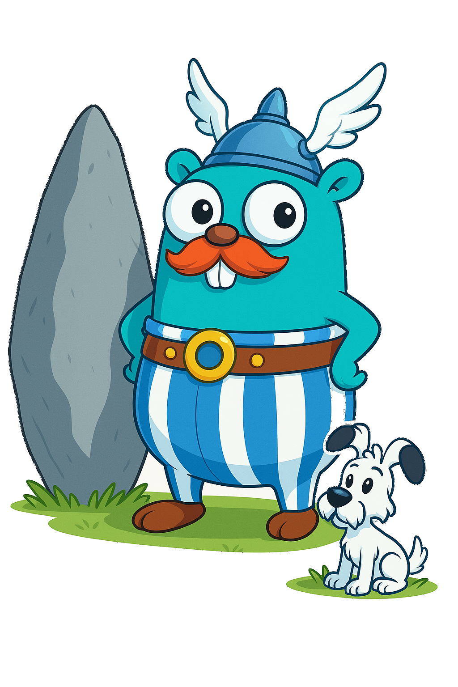

<p align="center">
  
</p>

<p align="center">
    <h1> Gobelix - The Golang ASTERIX Package</h1>
</p>

Gobelix is a high-performance Go library for encoding and decoding ASTERIX (All-purpose STructured Eurocontrol SurveIllance Information EXchange) protocol messages. ASTERIX is a binary protocol standardized by EUROCONTROL for exchanging surveillance data in Air Traffic Management systems.
<div align="center">
  
  
  
</div>

## ⚠️ Preamble

This package was created using Claude 3.7 Sonnet 🤖🤝👨🏻. It it currently a passion project and there is currently no guarantees for the correctness. Use at your own disgression. 

## 🚀 Installation

```bash
go get -u github.com/davidkohl/gobelix
```

## 🌐 ASTERIX Protocol and Gobelix Implementation

ASTERIX (All-purpose STructured Eurocontrol SurveIllance Information EXchange) is a binary message format standardized by EUROCONTROL for exchanging surveillance data in Air Traffic Management systems. Gobelix implements this protocol with a clean, idiomatic Go API.

### Core Components

#### Categories
**ASTERIX Concept**: Data is organized into categories, each designed for a specific application (e.g., 021 for ADS-B Target Reports, 048 for Monoradar Target Reports).

**Gobelix Implementation**: Each category is implemented as a separate package (`cat/cat021`, `cat/cat048`, etc.) with version-specific implementations to maintain compatibility with different ASTERIX specifications.

```go
// Creating UAPs for different categories
uap021, _ := cat021.NewUAP("2.6")
uap048, _ := cat048.NewUAP("1.6") 
uap062, _ := cat062.NewUAP("1.20")
uap063, _ := cat063.NewUAP("1.6")
```

#### Message Structure
**ASTERIX Concept**: ASTERIX uses two messaging paradigms depending on the specification version:

1. **Data Block Structure** (for Categories defined until Edition 2.1):
```
+----------+--------+----------+---------+--------+
| Category | Length | Record 1 | Record 2| ...    |
| (1 byte) |(2 bytes)| (var)   | (var)   | ...    |
+----------+--------+----------+---------+--------+
```

2. **Record Structure** (for Categories defined from Edition 2.2):
```
+----------+--------+----------+
| Category | Length | Record   |
| (1 byte) |(2 bytes)| (var)   |
+----------+--------+----------+
```

**Gobelix Implementation**: The library provides `DataBlock` and `Record` types in the `asterix` package to handle both paradigms transparently:

```go
// Creating and encoding a data block
dataBlock, _ := asterix.NewDataBlock(asterix.Cat021, uap)
dataBlock.AddRecord(record)
encodedData, _ := dataBlock.Encode()
```

#### Data Records and FSPEC
**ASTERIX Concept**: Each Record contains a Field Specification (FSPEC) bitmap indicating which data items are present, followed by the data items themselves.

```
+-------+----------+----------+----------+
| FSPEC | Data     | Data     | ...      |
|       | Item 1   | Item 2   |          |
+-------+----------+----------+----------+
```

**Gobelix Implementation**: The `Record` type manages the FSPEC internally, automatically updating it when items are added:

```go
record, _ := asterix.NewRecord(asterix.Cat021, uap)
// Adding items automatically updates the FSPEC
record.SetDataItem("I021/010", &common.DataSourceIdentifier{SAC: 25, SIC: 10})
```

#### User Application Profile (UAP)
**ASTERIX Concept**: The UAP defines the sequence and meaning of Data Items within a category, establishing a contract for how data is structured.

**Gobelix Implementation**: The `UAP` interface defines the structure for each category, with category-specific implementations that enforce validation rules:

```go
// UAP interface methods
type UAP interface {
    Category() Category
    Version() string
    Fields() []DataField
    CreateDataItem(id string) (DataItem, error)
    Validate(items map[string]DataItem) error
}
```

#### Data Items
**ASTERIX Concept**: Data Items are the fundamental units of information carrying specific data (e.g., position, velocity, identity).

**Gobelix Implementation**: Each Data Item is a Go struct implementing the `DataItem` interface with methods for encoding, decoding, and validation:

```go
// A simplified example of a Position Data Item
position := &common.Position{
    Latitude:  51.5074,
    Longitude: -0.1278,
}
```

## 💻 Usage Examples

### Decoding ASTERIX Messages

```go
package main

import (
	"fmt"
	"os"
	
	"github.com/davidkohl/gobelix/asterix"
	"github.com/davidkohl/gobelix/cat/cat021"
	"github.com/davidkohl/gobelix/cat/cat048"
	"github.com/davidkohl/gobelix/cat/cat062"
	"github.com/davidkohl/gobelix/cat/cat063"
)

func main() {
	// Create UAPs for the categories we want to decode
	uap021, _ := cat021.NewUAP("2.6")
	uap048, _ := cat048.NewUAP("1.6")
	uap062, _ := cat062.NewUAP("1.20")
	uap063, _ := cat063.NewUAP("1.6")
	
	// Create a decoder with the configured UAPs
	decoder, err := asterix.NewDecoder(uap021, uap048, uap062, uap063)
	if err != nil {
		fmt.Fprintf(os.Stderr, "Failed to create decoder: %v\n", err)
		os.Exit(1)
	}
	
	// Open a file with ASTERIX data
	file, err := os.Open("surveillance_data.bin")
	if err != nil {
		fmt.Fprintf(os.Stderr, "Failed to open file: %v\n", err)
		os.Exit(1)
	}
	defer file.Close()
	
	// Decode the message
	msg, err := decoder.Decode(file)
	if err != nil {
		fmt.Fprintf(os.Stderr, "Failed to decode: %v\n", err)
		os.Exit(1)
	}
	
	// Process the decoded data
	fmt.Printf("Decoded ASTERIX message:\n")
	fmt.Printf("  Category: %s\n", msg.Category)
	fmt.Printf("  Records: %d\n", msg.GetRecordCount())
	
	// Access data from the first record
	if msg.GetRecordCount() > 0 {
		// For ADS-B messages (Category 021)
		if msg.Category == asterix.Cat021 {
			for i := 0; i < msg.GetRecordCount(); i++ {
				if dataSourceItem, _, exists := msg.GetDataItemFromRecord("I021/010", i); exists {
					dsi := dataSourceItem.(*common.DataSourceIdentifier)
					fmt.Printf("  Data Source: SAC=%d, SIC=%d\n", dsi.SAC, dsi.SIC)
				}
				
				if positionItem, _, exists := msg.GetDataItemFromRecord("I021/130", i); exists {
					pos := positionItem.(*common.Position)
					fmt.Printf("  Position: Lat=%.6f°, Lon=%.6f°\n", pos.Latitude, pos.Longitude)
				}
			}
		}
	}
}
```

### Encoding ASTERIX Messages

```go
package main

import (
	"fmt"
	"os"
	
	"github.com/davidkohl/gobelix/asterix"
	"github.com/davidkohl/gobelix/cat/cat021"
	v26 "github.com/davidkohl/gobelix/cat/cat021/dataitems/v26"
	common "github.com/davidkohl/gobelix/cat/common/dataitems"
)

func main() {
	// Create a UAP for Category 021
	uap, err := cat021.NewUAP("2.6")
	if err != nil {
		fmt.Fprintf(os.Stderr, "Failed to create UAP: %v\n", err)
		os.Exit(1)
	}
	
	// Create a record
	record, err := asterix.NewRecord(asterix.Cat021, uap)
	if err != nil {
		fmt.Fprintf(os.Stderr, "Failed to create record: %v\n", err)
		os.Exit(1)
	}
	
	// Add mandatory data items
	record.SetDataItem("I021/010", &common.DataSourceIdentifier{SAC: 25, SIC: 10})
	
	// Add a target report descriptor
	record.SetDataItem("I021/040", &v26.TargetReportDescriptor{
		ATP: 1, // 1090 ES
		ARC: 0, // 25 ft resolution 
		RC:  false,
		RAB: false,
	})
	
	// Add target address (24-bit ICAO address)
	record.SetDataItem("I021/080", &v26.TargetAddress{Address: 0xABC123})
	
	// Add position (latitude/longitude)
	record.SetDataItem("I021/130", &common.Position{
		Latitude:  51.5074, // London
		Longitude: -0.1278,
	})
	
	// Add flight level
	record.SetDataItem("I021/145", &common.FlightLevel{Value: 350.0}) // FL350
	
	// Add target identification (callsign)
	record.SetDataItem("I021/170", &v26.TargetIdentification{Ident: "BAW123"})
	
	// Create a data block
	dataBlock, err := asterix.NewDataBlock(asterix.Cat021, uap)
	if err != nil {
		fmt.Fprintf(os.Stderr, "Failed to create data block: %v\n", err)
		os.Exit(1)
	}
	
	// Add the record to the data block
	if err := dataBlock.AddRecord(record); err != nil {
		fmt.Fprintf(os.Stderr, "Failed to add record: %v\n", err)
		os.Exit(1)
	}
	
	// Encode the data block
	encodedData, err := dataBlock.Encode()
	if err != nil {
		fmt.Fprintf(os.Stderr, "Failed to encode data: %v\n", err)
		os.Exit(1)
	}
	
	// Now you can send encodedData over a network or write it to a file
	fmt.Printf("Encoded %d bytes of ASTERIX data\n", len(encodedData))
	
	// Write to a file as an example
	if err := os.WriteFile("encoded_asterix.bin", encodedData, 0644); err != nil {
		fmt.Fprintf(os.Stderr, "Failed to write file: %v\n", err)
		os.Exit(1)
	}
}
```

## 🔍 Advanced Usage: Working with IDEFIX CLI

Gobelix comes with a companion CLI tool called IDEFIX that allows you to capture, view, and analyze ASTERIX data directly from the command line:

```bash
# Install IDEFIX
go install github.com/davidkohl/gobelix/idefix@latest

# Capture ASTERIX data from a UDP port
idefix dump -p 2000/udp --dump021 --output captured_data.txt

# View decoded data
cat captured_data.txt
```

## 🔍 Advanced Features

### 1. Encoder/Decoder Architecture

Gobelix provides high-level encoders and decoders that handle the complexities of the ASTERIX protocol:

```go
// Creating a decoder with multiple category support
decoder, _ := asterix.NewDecoder(uap021, uap048, uap062, uap063)

// Decoding from any io.Reader
message, _ := decoder.Decode(networkStream)

// Creating an encoder
encoder, _ := asterix.NewEncoder(uap021, uap062)

// Encoding to any io.Writer
encoder.Encode(outputFile, message)
```

### 2. Message Validation

Gobelix performs extensive validation at all levels:

- Data item structural validation during encoding/decoding
- Record-level validation against UAP rules
- Cross-field consistency checks
- Range validation for numeric values

```go
// Validate method is called automatically during encoding
// but can also be called explicitly
if err := position.Validate(); err != nil {
    // Handle validation error
}
```

### 3. Error Handling and Diagnostics

The library provides rich error context to diagnose issues:

```go
// DecodeError provides detailed information
type DecodeError struct {
    Category   Category
    Message    string
    DataItem   string
    Position   int
    BufferSize int
    Cause      error
}
```

## 🔧 Error Handling

Gobelix provides detailed error context to help diagnose issues:

```go
// Example error handling
msg, err := decoder.Decode(reader)
if err != nil {
    if asterix.IsDecodeError(err) {
        // Get detailed decode error information
        decodeErr := err.(*asterix.DecodeError)
        fmt.Printf("Decode error in category %d, data item %s at position %d: %s\n",
            decodeErr.Category, decodeErr.DataItem, decodeErr.Position, decodeErr.Message)
    } else {
        fmt.Printf("Error: %v\n", err)
    }
    return
}
```

## 📚 Architecture

Gobelix is designed with a layered architecture:

1. **Core Layer**: Basic ASTERIX types and interfaces (asterix package)
2. **Category Layer**: Category-specific implementations (cat/catXXX packages)
3. **Data Item Layer**: Specific field implementations (cat/catXXX/dataitems/vYY packages)


This architecture allows for easy extension to support new ASTERIX categories or versions.


## 🙏 Acknowledgments

Named after the character from the Asterix comic series, with a nod to the Go language.

Gobelix implements the ASTERIX protocol as defined by EUROCONTROL in "EUROCONTROL Specification for Surveillance Data Exchange - Part 1 All Purpose Structured EUROCONTROL Surveillance Information Exchange (ASTERIX)" (Edition 3.1).